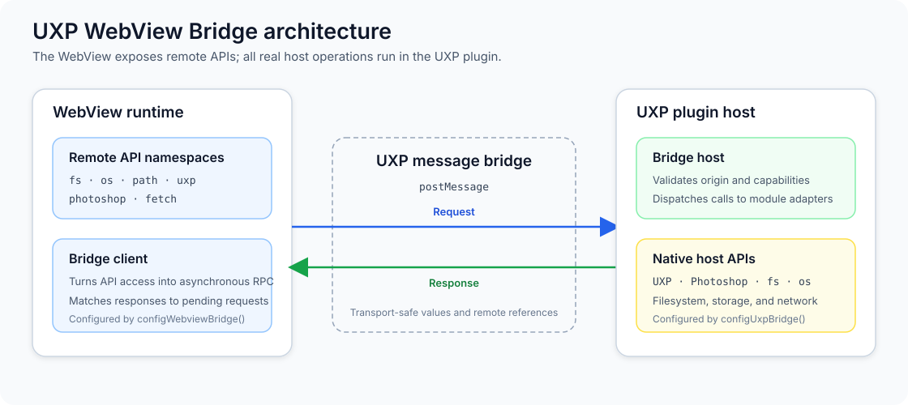

# uxp-webview-bridge

[中文说明](./README_zh.md)

`uxp-webview-bridge` exposes selected Adobe UXP and Photoshop APIs to a WebView while keeping every real host operation in the UXP plugin runtime. The WebView imports asynchronous remote namespaces; the UXP side validates message origins and capabilities, dispatches calls, and owns native resources.

> [!IMPORTANT]
> This package is in early development. The supported surface is the API documented below, not every member in Adobe's UXP or Photoshop type declarations.

## Contents

- [Why use it?](#why-use-it)
- [Architecture and communication](#architecture-and-communication)
- [Installation and build](#installation-and-build)
- [Quick start](#quick-start)
- [Capability overview](#capability-overview)
- [Detailed supported API](#detailed-supported-api)
- [Bridge semantics](#bridge-semantics)
- [Host permissions and security](#host-permissions-and-security)
- [Compatibility and limitations](#compatibility-and-limitations)
- [Testing](#testing)

## Why use it?

A UXP WebView cannot directly call host-only modules such as `require("uxp")`, `require("photoshop")`, `fs`, or `os`. This library provides:

- direct WebView-side namespaces such as `fs`, `os`, `path`, `uxp`, and `photoshop`;
- forwarded `fetch` executed by the UXP host, avoiding browser CORS enforcement;
- transport-safe binary payloads, remote callbacks, cancellation, timeouts, and structured remote errors;
- stable remote identity for Photoshop documents and layers;
- host-owned modal execution for mutating Photoshop operations; and
- capability and origin checks on the UXP side.

The runtime boundary is deliberate: import `uxp-webview-bridge/webview` only in the WebView bundle and `uxp-webview-bridge/uxp` only in the UXP host bundle.

## Architecture and communication



A normal request follows this path:

1. A WebView namespace or `RemoteClass` turns an asynchronous property read or
   method call into a bridge operation. Queued property writes flush before the
   next read or call.
2. `RpcClient` assigns an `operationId`, records the pending Promise, and sends a
   transport-safe request envelope through `window.uxpHost.postMessage`.
3. `RpcHost` accepts messages only from a trusted source and origin. The module
   registry then validates the module and method and checks its leaf capability
   before selecting a host adapter.
4. The adapter invokes the real UXP, Photoshop, operating system, filesystem,
   or network API. Native objects remain on this side and cross the bridge only
   as values, binary envelopes, or stable remote references.
5. The host posts a `bridge.success` or `bridge.error` envelope back to the
   WebView. `RpcClient` matches the `operationId`, settles the original Promise,
   and converts a remote failure into `BridgeRemoteError`.

Cancellation and host-to-WebView callbacks use the same channel. Cancel
envelopes target an in-flight `operationId`; callback envelopes add a
`callbackId` and, for nested modal work, a `sessionId`. Destroying either runtime
releases pending operations and host-owned bridge resources.

## Installation and build

Install the package from the public npm registry:

```bash
pnpm add uxp-webview-bridge
```

To contribute to the package, clone the repository and build it locally:

```bash
pnpm install
pnpm build
```

In a pnpm workspace, add it to the consuming package as a workspace dependency:

```json
{
  "dependencies": {
    "uxp-webview-bridge": "workspace:*"
  }
}
```

Bundle the two subpath entrypoints into their respective runtimes. Do not load the UXP entrypoint in the WebView or the WebView entrypoint in UXP.

## Quick start

### 1. Configure the UXP host

Configure the bridge once for the `<webview>` element. Business RPCs are denied by default, so this example explicitly allows only the six leaves used below:

```ts
import { configUxpBridge } from "uxp-webview-bridge/uxp";

const webview = document.querySelector("webview") as
  | Parameters<typeof configUxpBridge>[0]["webview"]
  | null;

if (!webview) {
  throw new Error("The plugin WebView element was not found.");
}

const bridge = configUxpBridge({
  webview,
  capabilities: ["fetch", "fs", "os", "path", "photoshop.dom", "uxp.host"]
});

window.addEventListener("unload", () => {
  void bridge.destroy();
});
```

For remotely hosted WebView content, configure the exact trusted origin on both sides:

```ts
const allowedOrigins = ["https://app.example.com"];

const bridge = configUxpBridge({
  webview,
  allowedOrigins,
  capabilities: ["fetch", "fs", "os", "path", "photoshop.dom", "uxp.host"]
});
```

Both bridge sides always allow the UXP-local `plugin:`, `plugin-data:`, and `plugin-temp:` schemes, plus HTTP and HTTPS loopback origins using `localhost` or `127.0.0.1` on any port. `allowedOrigins` only appends trusted origins; it never replaces these defaults. An added value ending in `:` matches that entire scheme prefix, while any other added value is an exact origin match.

### 2. Configure and use the WebView

```ts
import {
  configWebviewBridge,
  fetch as hostFetch,
  fs,
  os,
  path,
  photoshop,
  uxp
} from "uxp-webview-bridge/webview";

const bridge = configWebviewBridge({
  timeoutMs: 15_000,
  allowedOrigins: ["https://app.example.com"]
});

const platform = await os.platform();
const dataPath = await path.join("plugin-data:", "settings.json");

await fs.writeFile(dataPath, JSON.stringify({ platform }), { encoding: "utf-8" });
const response = await hostFetch("https://api.example.com/status");
const hostName = await uxp.host.name;
const activeDocument = await photoshop.app.activeDocument;

console.log({ hostName, documentName: await activeDocument.name, status: response.status });

window.addEventListener("unload", () => {
  void bridge.destroy();
});
```

Without an explicit `target`, the WebView client posts through `window.uxpHost`. Call and await `destroy()` before configuring the same side again.

## Capability overview

Every known Business RPC maps to exactly one leaf Bridge capability. Omitting `capabilities` is equivalent to `[]`, so every row below defaults to denied.

- **Contract**: covered by the local static/type/Node contract gates.
- **CDP case**: a real UXP/Photoshop test case exists; individual cases may skip when the host lacks an API or required permission.

| Leaf capability | WebView API | Default | Verification | Notes |
| --- | --- | --- | --- | --- |
| `clipboard` | `clipboard` | Denied | Contract + CDP case | Text and UXP clipboard data; manifest permission may also be required. |
| `crypto` | `crypto` | Denied | Contract + CDP case | `getRandomValues` and `randomUUID` execute in UXP. |
| `fetch` | `fetch`, `installFetch` | Denied | Contract | Request runs in UXP; network manifest permissions still apply. |
| `fs` | `fs` | Denied | Contract + CDP case | File descriptors are host-owned and idle-close after 60 seconds. |
| `localStorage` | `localStorage` | Denied | Contract + CDP case | Asynchronous UXP-side local storage. |
| `os` | `os` | Denied | Contract + CDP case | Read-only platform and memory/CPU information. |
| `path` | `path` | Denied | Contract + CDP case | Default, `posix`, and `win32` flavors. |
| `sessionStorage` | `sessionStorage` | Denied | Contract + CDP case | Asynchronous UXP-side session storage. |
| `photoshop.dom` | Photoshop DOM and Action methods other than the public batchPlay methods | Denied | Contract + CDP case | Includes remote objects and DOM implementation calls. |
| `photoshop.core` | `photoshop.core` | Denied | Contract + CDP case | Independent of the DOM, Imaging, and batchPlay leaves. |
| `photoshop.imaging` | `photoshop.imaging` | Denied | Contract + CDP case | Includes image-data handle methods. |
| `photoshop.batchPlay` | `photoshop.action.batchPlay`, `.batchPlaySync`, `photoshop.app.batchPlay` | Denied | Contract + CDP case | Controls only the three public batchPlay RPC methods. |
| `uxp.host` | `uxp.host` | Denied | Contract + CDP case | Host name, version, and UI locale. |
| `uxp.versions` | `uxp.versions` | Denied | Contract + CDP case | UXP and plugin versions. |
| `uxp.shell` | `uxp.shell` | Denied | Contract + CDP case | Manifest launch permissions still apply. |
| `uxp.userInfo` | `uxp.userInfo` | Denied | Contract + CDP case | Requires `enableUserInfo` in the manifest. |
| `uxp.pluginManager` | `uxp.pluginManager` | Denied | Contract + CDP case | Plugin snapshots, panels, and commands. |
| `uxp.storage.secureStorage` | `uxp.storage.secureStorage` | Denied | Contract + CDP case | String/binary writes and binary reads. |
| `uxp.storage.localFileSystem` | `uxp.storage.localFileSystem` and Entry proxies | Denied | Contract + CDP case | Pickers, tokens, entries, files, and folders. |
| `uxp.xmp` | `uxp.xmp` | Denied | Contract + CDP case | XMP remote objects, utilities, and constants. |

Arrays may also contain the configuration-only groups `photoshop.all`, `uxp.all`, and `uxp.storage.all`. A group expands to all of its descendant leaves known to the installed library version. Top-level `capabilities: "all"` expands to every known leaf; `["all"]` is invalid. Both `"all"` and `*.all` may authorize newly added leaves after a package upgrade, so production configurations that require stable least privilege should enumerate leaf names.

The runtime copies and normalizes the input, deduplicates overlapping selectors, and exposes the frozen leaf snapshot in catalog order as `bridge.capabilities`. Unknown selectors, wildcards such as `uxp.*`, and the old boolean object throw `TypeError` before listener or adapter setup. To change policy, destroy the runtime and configure a new one.

### Migrating from boolean capability overrides

Before:

```ts
configUxpBridge({
  webview,
  capabilities: { fs: true, shell: true, photoshop: true }
});
```

After:

```ts
configUxpBridge({
  webview,
  capabilities: ["fs", "uxp.shell", "photoshop.dom"]
});
```

Use `capabilities: "all"` only as an intentional permissive migration or development escape hatch. Capabilities restrict bridge dispatch; they do not add Adobe UXP manifest permissions, accept a WebView origin, or make an unavailable host API exist.

## Detailed supported API

### UXP and runtime-neutral namespaces

| Namespace | Supported members |
| --- | --- |
| `clipboard` | `write`, `writeText`, `read`, `readText` |
| `crypto` | `getRandomValues`, `randomUUID` |
| `fetch` | Native-like `fetch(input, init)` returning a WebView `Response`; request headers, text/binary/form bodies, redirects, and `AbortSignal`; `installFetch()` opt-in global replacement and uninstaller |
| `fs` | `readFile`, `writeFile`, `open`, `close`, `read`, `write`, `lstat`, `rename`, `copyFile`, `unlink`, `mkdir`, `rmdir`, `readdir`; string and binary transport; `Stats` predicates |
| `os` | `platform`, `release`, `arch`, `cpus`, `totalmem`, `freemem`, `homedir` |
| `path` | `sep`, `delimiter`, `normalize`, `join`, `resolve`, `isAbsolute`, `relative`, `dirname`, `basename`, `extname`, `parse`, `format`; also `path.posix` and `path.win32` |
| `localStorage`, `sessionStorage` | Async `length`, `key`, `getItem`, `setItem`, `removeItem`, `clear` |
| `uxp.host` | Async `name`, `version`, `uiLocale` |
| `uxp.versions` | Async `uxp`, `plugin` |
| `uxp.shell` | `openPath`, `openExternal`; `file:` URLs are rejected by `openExternal`, so use `openPath` for files |
| `uxp.userInfo` | `userId` |
| `uxp.pluginManager` | Async `plugins`; plugin `id`, `version`, `name`, `manifest`, `enabled`, `showPanel`, `invokeCommand` |
| `uxp.storage.secureStorage` | Async `length`, `setItem`, `getItem`, `removeItem`, `key`, `clear` |
| `uxp.storage.localFileSystem` | Open/save/folder pickers; temporary/data/plugin folders; URL entry creation and lookup; FS/native paths; session and persistent tokens |
| UXP storage entries | Entry metadata, `copyTo`, `moveTo`, `delete`, and `dispose`; file `read`/`write`; folder listing, creation, lookup, and rename; type guards and native constant tables |
| `uxp.xmp` | `XMPMeta`, `XMPFile`, `XMPDateTime`, `XMPIterator`, `XMPUtils`, and `XMPConst`, including metadata property/array/struct/qualifier operations, serialization, file packet operations, namespace utilities, and explicit disposal |

### Photoshop namespaces and remote objects

| Surface | Supported members or object families |
| --- | --- |
| `photoshop` | `app`, `action`, `core`, `imaging`, synchronous Photoshop constant tables, color constructors, `SolidColor`, `PathPointInfo`, and `SubPathInfo` |
| `photoshop.app` | Active document, documents, dialogs, foreground/background colors, current tool, action tree, fonts, preferences; color profiles, unit conversion, alerts, `batchPlay`, bring-to-front, open/create document, UI update, `batchGet`, and queued `batchSet` |
| `photoshop.action` | `batchPlay`, `batchPlaySync`, `getIDFromString`, `recordAction`, `validateReference`, and notification listener registration/removal |
| `photoshop.core` | `apiVersion`, notification listeners, dialog sizing, color conversion, global/local coordinate conversion, temporary document ownership, modal execution, tool/CPU/GPU/display/layer-tree/menu/plugin/idle-time queries, menu execution, redraw, execution mode, alert, resize-gripper, and UI-string translation |
| `photoshop.imaging` | `getPixels`, `putPixels`, `getLayerMask`, `putLayerMask`, `getSelection`, `putSelection`, `createImageDataFromBuffer`, and `encodeImageData`; `PsImageData.getData()` and required `dispose()` |
| Documents | Scalar and writable document properties; layers, channels, guides, paths, selection, history, color samplers, count items, layer comps, save-as helpers; duplicate/close/save, flatten/merge, crop/resize/rotate/trim, layer factories and grouping, color-mode/profile conversion, calculations, generative upscale, and callback-based `suspendHistory` |
| Layers | Readable/writable layer state, bounds and related objects; duplicate/link/move/transform/stack/edit/rasterize; the declared filter methods and `applyImage`; `batchGet` and queued `batchSet` |
| Selection and channels | Selection geometry/load/save/boundary operations; channel read/write state, duplicate/merge/remove, and channel collections |
| History, guides, and paths | History snapshots; guide creation/update/removal; path items, subpaths, path points, fill/stroke/selection/clipping operations, and path collections |
| Text | `TextItem`, character style, paragraph style, warp style, conversion/reset methods, readable/writable text properties, and font collections |
| Other DOM families | Color samplers, count items/groups, layer comps, tools, action sets/actions, value objects, and collection wrappers |
| Preferences | Root preferences and cursors, file handling, general, guides/grids/slices, history, interface, notifications, performance, tools, transparency/gamut, type, and units/rulers groups through async properties and batch operations |

The TypeScript declarations exported from `uxp-webview-bridge/webview` are the precise source for method signatures and property types. A native Adobe type appearing in the mirrored declaration files does not by itself mean that the bridge implements that member.

## Bridge semantics

### Async reads and ordered writes

Remote properties are asynchronous:

```ts
const document = await photoshop.app.activeDocument;
const name = await document.name;
```

JavaScript setters cannot be asynchronous. A remote property write is queued, and the bridge flushes queued writes before a later read or method call:

```ts
const layer = (await document.activeLayers)[0];

if (layer) {
  layer.name = "Processed";       // queued
  layer.opacity = 75;             // queued after name
  console.log(await layer.name);  // flushes both writes first
}
```

Every WebView remote class exposes typed `batchGet(...)` and `batchSet(...)` methods. A batch uses one
bridge request, preserves queued write ordering, and can be awaited through Host completion:

```ts
const { name, opacity } = await layer.batchGet(["name", "opacity"]);
await layer.batchSet({ name: "Processed", opacity: 75 });
```

Invalid or read-only keys reject locally with `TypeError`; Host failures reject as
`BridgeRemoteError`. Empty batches on classes without properties settle locally without an RPC.

### Remote identity and collections

Documents and layers use stable remote references. Resolving the same native object returns the same live WebView proxy where possible. Persistent DOM references do not require routine user disposal.

Collection wrappers are local point-in-time snapshots. They do not auto-refresh; request the collection property again to observe host-side additions or removals.

Transient resource handles do require cleanup. In particular, call `PsImageData.dispose()` and close `fs` file descriptors. The host also applies timeout cleanup and releases resources when the bridge runtime is destroyed.

### Modal execution

The UXP host owns Photoshop modal policy. Declared mutating DOM and imaging calls are wrapped in `executeAsModal`; reads do not enter modal execution unnecessarily. `photoshop.core.executeAsModal` and `PsDocument.suspendHistory` bridge callbacks and nested calls through a single host modal session.

### Errors, cancellation, and binary values

Host failures reject in the WebView as errors named `BridgeRemoteError`. They preserve remote `name`, `message`, `stack`, optional `code`, and the bridge `operationId`; callback errors may also carry parent operation and callback metadata.

A capability denial has `code === "ERR_BRIDGE_CAPABILITY_DISABLED"`, `remoteName === "BridgeCapabilityError"`, and the exact `operationId`, leaf `capability`, protocol `module`, and validated `method`. These fields are the stable programmatic contract; the message is diagnostic text and never includes request arguments.

Cancelable operations use a bridge cancel envelope. Forwarded `fetch` maps `AbortSignal` cancellation to it. Binary values are copied through transport-safe inline/base64 envelopes rather than relying on transferable `postMessage` objects.

## Host permissions and security

Bridge capabilities, source/origin validation, and Adobe UXP manifest permissions are three independent controls. A capability only authorizes bridge dispatch; it does not trust an origin or grant a native permission. Add only the permissions used by your plugin. Depending on the selected APIs, the manifest may need:

- WebView and message bridge access;
- `network` domains for forwarded `fetch`;
- `localFileSystem` for `fs` or persistent file APIs;
- `clipboard` access;
- `launchProcess` schemes/extensions for `uxp.shell`; and
- `enableUserInfo` for `uxp.userInfo`.

The UXP host validates both the message source and its origin before dispatch. Keep `allowedOrigins` narrow for remote content. Values such as `http:` and `https:` allow every origin using that scheme and should only be used when that broad trust is intentional. A missing capability rejects the corresponding call before adapter dispatch or native module loading.

## Compatibility and limitations

- The repository's real-host fixture declares Photoshop `24.4.0` as its minimum. This is the test fixture's floor, not a published compatibility guarantee for every bridge member.
- Photoshop Core methods check whether the native function exists and return a coded remote error when the current host is too old. The implemented Core surface spans native APIs introduced across Photoshop 22.5 through 26.0.
- Other UXP and Photoshop calls remain subject to the installed application's API version, document mode/state, platform, and manifest permissions.
- The bridge does not promise complete parity with all Adobe UXP or Photoshop APIs. Only the public surface in this README and the exported WebView types is supported.
- Forwarded `fetch` buffers request and response bodies. It does not support `ReadableStream` request bodies and does not provide streaming responses.
- Binary data is serialized and copied, so very large files or pixel buffers have more overhead than same-runtime native calls.
- The four Photoshop leaves are independent: enabling DOM, Core, Imaging, or public batchPlay does not enable any of the other three surfaces.
- This package is ESM at its public boundary. UXP hosts commonly require a bundling step appropriate to the target runtime.

## Testing

Run the complete local gate, which does not require Photoshop:

```bash
pnpm test
```

The individual checks are:

```bash
pnpm test:static
pnpm typecheck
pnpm test:contract
pnpm build
```

Run real UXP/Photoshop CDP coverage only with the fixture plugin and compatible host available:

```bash
pnpm test:uxp
pnpm test:uxp -- --case os.platform
```

CDP cases create and clean up their own test state where required; host-dependent cases may report `skipped`. See [test/TESTING.md](./test/TESTING.md) and [test/README.md](./test/README.md) for the test contract and runner details. See [CONTEXT.md](./CONTEXT.md) for project terminology and architecture context.

## License

[MIT](./LICENSE)
